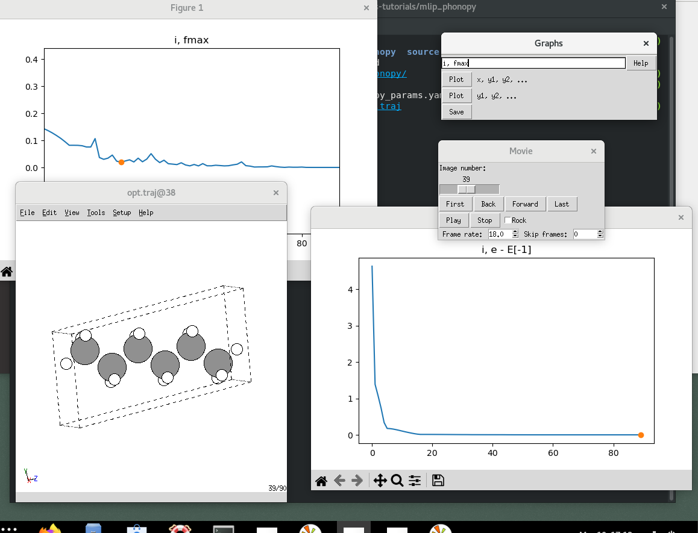
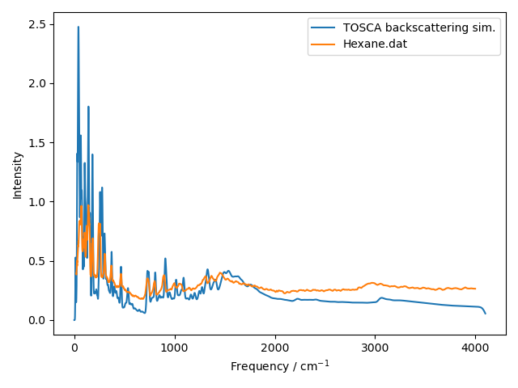

.. _mlip-phonopy:

=======================================
 Using a pre-trained MLIP with Phonopy
=======================================

For accurate results one would typically compute phonons with density-functional theory or with a system-specific interatomic potential. However, at the early stages of a project it may be useful to run a "general" machine-learned interatomic potential (MLIP) which is been trained on a variety of systems.

In this tutorial we primarily use the MACE-OFF23 [#mace-off]_ potential which is trained on organic molecules; the more general MACE-MP-0 [#mace-mp-0]_ can be used in the same way for other chemistries. In both cases we are using the ASE Calculator interface; most popular MLIP packages have an ASE interface and so can be used in a similar fashion.

We will also use ASE for geometry optimisation and Phonopy for setting-up/post-processing the force-constant calculations.

This example workflow is implemented as a small Python program, with
steps broken out into different functions. We will examine the
functions separately in this document: to test the overall workflow
you can run the program, or implement your own using the building
blocks shown.

Step 0: setting up the machine-learned interatomic potential (MLIP)
===================================================================

First, we need to set up an MLIP implementation. Here we assume that
the MACE package has already been installed into the current
environment. (See: :doc:`environment-setup`.) Then we can create an
ASE calculator, ready to attach to a structure (Atoms) object.

.. literalinclude:: ../mlip_phonopy/mlip_phonopy.py
   :start-after:  if model == MLIP.MACE_OFF_23:
   :end-before:   elif model == MLIP.MACE_MP_0:

There are a range of MLIP packages available and most of them provide
an ASE calculator, or have had one wrapped around them. Here are a
few, in no particular order:

=========================================================================================   ============================================
MLIP package                                                                                ASE interface
=========================================================================================   ============================================
`QUIP (GAP) <https://libatoms.github.io/GAP/>`_                                              `quippy <https://libatoms.github.io/GAP/quippy-potential-tutorial.html>`_
`JuLIP <https://github.com/JuliaMolSim/JuLIP.jl>`_ `(ACE) <https://acesuit.github.io>`_     `pyjulip <https://github.com/casv2/pyjulip>`_
`MACE <https://mace-docs.readthedocs.io/en/latest/>`_                                                  Yes
`pacemaker (ACE) <https://pacemaker.readthedocs.io/en/latest/>`_                                       Yes
`GPUMD (NEP) <https://gpumd.org>`_                                                          `calorine <https://calorine.materialsmodeling.org>`_
`NequIP <https://github.com/mir-group/nequip>`_                                             Yes
`n2p2 <https://github.com/CompPhysVienna/n2p2>`_                                            via LAMMPS
`SchNetPack <https://github.com/atomistic-machine-learning/schnetpack>`_                    Yes
=========================================================================================   ============================================

Step 1: geometry optimisation
=============================

First, we grab an `input structure for hexane from the CCSD <https://doi.org/10.5517/cc3gcpl>` in CIF format.
Here the file provided by CCSD has already been converted to a
simpler format and saved as a "geometry.in" file in the FHI-aims
format. (As we will be using ASE, we can work with whichever format
looks the nicest!)

We then optimise the geometry with a very fine force criterion, in
order to get as close to the minimum-energy configuration as
possible.

.. literalinclude:: ../mlip_phonopy/mlip_phonopy.py
    :start-at: atoms = ase.io.read(filename)
    :end-at: atoms = get_optimized_geometry(atoms, calc)

.. literalinclude:: ../mlip_phonopy/mlip_phonopy.py
   :start-at: def get_optimized_geometry
   :end-at:   return atoms

To get a sense of the optimisation progress, examine the trajectory file with

.. code-block:: sh

   ase gui opt.traj

and create a plot of max forces by entering ``i, fmax`` in the Graphs window.
   

Step 2: finite displacements
============================

We will use the `Phonopy <https://phonopy.github.io/phonopy/index.html>`_
Python API to create supercells with displaced atoms and analyse the forces.

A few lines of code are needed to adapt between the ASE and phonopy structure representations: to keep things tidy we wrap these into functions.

.. literalinclude:: ../mlip_phonopy/mlip_phonopy.py
                    :start-at: def phonopy_from_ase(atoms: Atoms)
                    :end-before: def main(

Now we set up the displacements: the displaced structures are created on the Phonopy object as ``phonopy.supercells_with_displacements``. SYMPREC (symmetry threshold) and DISP_SIZE (finite displacement distance) are parameters controlling the displacement scheme; in the sample program they are set to 1e-4 and 1e-3 respectively.
The supercell matrix is another user parameter; this has a significant impact on the runtime and the quality of results, so should be checked carefully.

.. literalinclude:: ../mlip_phonopy/mlip_phonopy.py
   :start-after: print("Step 2: set up phonon displacements...")
   :end-before:  print("Step 3: calculate forces on displacements...")

Step 3: force calculations
==========================

Using ASE the idiom for calculating forces on a structure is:

- attach a "calculator" to the structure ``atoms.calc = calculator``
- call ``atoms.get_forces())``

Here we do this for each of the displaced supercells, collecting the results into a list for later use.
`tqdm <https://tqdm.github.io>`_ is used to make a nice progress bar while this runs; for large supercells it may take a while!
  
.. literalinclude:: ../mlip_phonopy/mlip_phonopy.py
   :start-after: print("Step 3: calculate forces on displacements...")
   :end-before:  print("Step 4: Construct force constants...")

Step 4: constructing force constants
====================================

The force constants are the Hessian of our supercell, and can be used
to generate phonon band structures and simulated neutron spectra.

We attach the calculated forces to the Phonopy object and instruct it
to compute the force constants and write data files.

.. literalinclude:: ../mlip_phonopy/mlip_phonopy.py
    :start-after: print("Step 4: Construct force constants...")

Here we write the force constants to a ``force_constants.hdf5`` file. This is only
recently supported by Abins; to include the force constants in the
.yaml file instead use

.. code-block:: python

    phonopy.save(filename=PHONOPY_FILE, settings={"force_constants": True})

This is compatible with more versions of Abins, and more convenient as the file can have any name.
However, the data loading may be noticeably slower as the `YAML format <https://en.wikipedia.org/wiki/YAML>`_
is not designed for large numerical arrays.

Step 5: INS simulation with Abins Python interface
==================================================

Plotting is implemented in a separate script ``abins_plot.py``. After collecting the phonopy data ``filename`` and measurement ``temperature`` from the user we can call Abins:

.. literalinclude:: ../mlip_phonopy/abins_plot.py
                    :start-at: mantid.simpleapi.Abins(
                    :end-before: workspace = mantid

Abins is an "Algorithm" in Mantid, and writes its results to Workspace
objects. In a graphical Workspace session we can manage these from an
interactive panel: from Python it can be useful to check our available
workspaces using

.. code-block:: python

  mantid.simpleapi.AnalysisDataService.getObjectNames()

.. code-block:: text

  ['abins-output',
   'abins-output_C_quantum_event_1',
   'abins-output_C_quantum_event_10',
   'abins-output_C_quantum_event_2',
   'abins-output_C_quantum_event_3',
   'abins-output_C_quantum_event_4',
   'abins-output_C_quantum_event_5',
   'abins-output_C_quantum_event_6',
   'abins-output_C_quantum_event_7',
   'abins-output_C_quantum_event_8',
   'abins-output_C_quantum_event_9',
   'abins-output_C_total',
   'abins-output_H_quantum_event_1',
   'abins-output_H_quantum_event_10',
   'abins-output_H_quantum_event_2',
   'abins-output_H_quantum_event_3',
   'abins-output_H_quantum_event_4',
   'abins-output_H_quantum_event_5',
   'abins-output_H_quantum_event_6',
   'abins-output_H_quantum_event_7',
   'abins-output_H_quantum_event_8',
   'abins-output_H_quantum_event_9',
   'abins-output_H_total',
   'abins-output_total']

In our script we know the workspace of interest will always be called
"abins-output_total", so we access this using ``mantid.simpleapi.mtd``
and extract the data into a plot-friendly form.

.. literalinclude:: ../mlip_phonopy/abins_plot.py
                    :start-at: workspace = mantid
                    :end-at: frequency_midpoints =

We plot the data using Matplotlib; if you prefer some other tool
(e.g. Grace, Origin, d3...) then it may be helpful to write the data
values to a file instead.

.. literalinclude:: ../mlip_phonopy/abins_plot.py
                    :start-at: fig, ax = plt.subplots
                    :end-before: if ref_dat is None:

In this case we would also like to plot against some experimental
data: we have a file "Hexane.dat" from the
`ISIS INS Database <http://wwwisis2.isis.rl.ac.uk/INSdatabase/>`_
with data from an experimental measurement on the TXFA instrument. [#txfa-alkanes]_
The file is in a Mantid-friendly format that can be read with the Load Algorithm.

.. literalinclude:: ../mlip_phonopy/abins_plot.py
                    :start-at: ref_workspace = mantid.simpleapi.Load
                    :end-at: ax.legend()

With a bit of arbitrary scaling in the ``ref_scale`` variable we get a nice comparison:

Note that the TXFA instrument pre-dates TOSCA; while the geometry is
similar to the TOSCA backscattering bank, we expect the resolution to
be broader and the background to be higher.

The agreement of many peaks is excellent for a general-purpose potential. Do have a try with some different models, not all of them will match experiment this way! One might also look at the effect of changing supercell dimensions and displacement sizes.

.. rubric:: References

.. [#mace-off]   \D. P. Kovács et al. (2023) "MACE-OFF23: Transferable Machine Learning Force Fields for Organic Molecules" https://arxiv.org/abs/2312.15211
.. [#mace-mp-0]   \I. Batatia et al. (2024) "A foundation model for atomistic materials chemistry" https://arxiv.org/abs/2401.00096
.. [#txfa-alkanes] \D. A. Braden et al. (1999) "Inelastic neutron scattering spectra of the longitudinal acoustic modes of the normal alkanes from pentane to pentacosane" *J. Chem. Phys.* **111**, 429-437 https://doi.org/10.1063/1.479293
